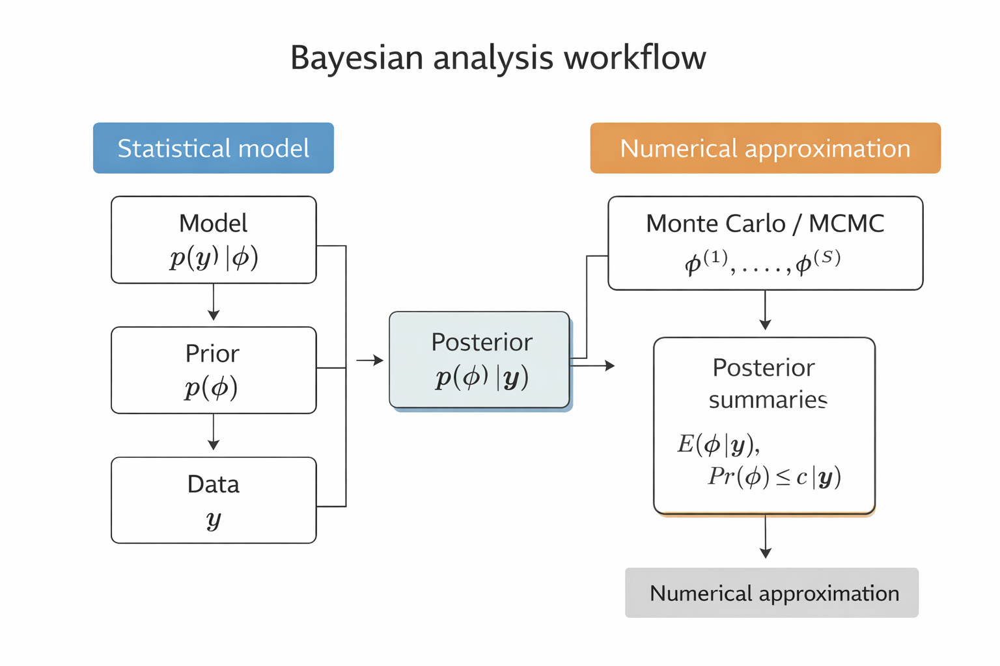

# Gibbs Sampler

> Leading objectives:
>
> -   understand why posterior approximation is needed beyond conjugate models
> -   learn how to approximate posteriors using discrete grids and Gibbs sampling
> -   understand how Gibbs sampling uses full conditional distributions to generate dependent posterior samples

## Introduction

For many multi-parameter Bayesian models, the joint posterior distribution does not belong to a standard family (e.g., exponential family) and is therefore difficult to sample from it directly. However, it is often the case that **sampling from the full conditional distribution of each parameter is straightforward**.

In such situations, posterior approximation can be carried out using the **Gibbs sampler**, an iterative MC algorithm that constructs a **dependent sequence of parameter values** whose distribution converges to the target joint posterior distribution. Here, we introduce the Gibbs sampler in the context of the normal model with a **semi-conjugate prior**, and study how well it approximates the posterior distribution.

## A Semi-conjugate Prior Distribution

For normal distribution, it may be modelled our uncertainty about the population mean $\theta$ as depending on the sampling variance $\sigma^2$ via

$$
\theta \mid \sigma^2 \sim
N\!\left(\mu_0,\; \frac{\sigma^2}{\kappa_0}\right).
$$

This formulation ties the prior variance of $\theta$ to the sampling variability of the data, and $\mu_0$ can be interpreted as representing $\kappa_0$ prior observations from the population.

In some settings this dependence is reasonable, but in others we may wish to specify prior uncertainty about $\theta$ *independently* of $\sigma^2$ denoted as $\theta \perp\sigma^2$, so that $$
p(\theta, \sigma^2) = p(\theta)\,p(\sigma^2).
$$

One such specification is the following **semi-conjugate prior distribution**: $$
\theta \sim \text{Normal}(\mu_0, \tau_0^2),
\qquad
\frac{1}{\sigma^2} \sim \text{Gamma}\!\left(\frac{\nu_0}{2}, \frac{\nu_0 \sigma_0^2}{2}\right).
$$

**Posterior Distribution of** $\theta \mid \sigma^2$

Note that, if $$
Y_1, \dots, Y_n \mid \theta, \sigma^2 \;\overset{i.i.d.}{\sim}\; N(\theta, \sigma^2),
$$

then the posterior distribution of $\theta$ is $$
\theta \mid \sigma^2, y_1, \dots, y_n
\;\sim\;
\text{Normal}(\mu_n, \tau_n^2),
$$ where $$
\mu_n
=
\frac{\mu_0 / \tau_0^2 + n \bar{y} / \sigma^2}
     {1 / \tau_0^2 + n / \sigma^2},
\qquad
\tau_n^2
=
\left( \frac{1}{\tau_0^2} + \frac{n}{\sigma^2} \right)^{-1}.
$$ Those calculation may be found in Section 5.2 in Hoff (2009).

This conditional posterior distribution will form one step of the Gibbs sampler.

::: {.callout-note title="Key Takeaway"}
-   The **joint posterior** of $(\theta, \sigma^2)$ is not available in closed form.
-   The **full conditional distributions** of $\theta \mid \sigma^2, y$ and $\sigma^2 \mid \theta, y$ *are* available in standard forms.
-   This structure makes the Gibbs sampler a natural and efficient tool for posterior approximation.
:::

In the next section, we derive the full conditional distribution of $\sigma^2$ and combine the two conditional updates into a complete Gibbs sampling algorithm.

In the conjugate case where $\tau_0^2$ is proportional to $\sigma^2$, we showed that the marginal posterior distribution $$
p(\sigma^2 \mid y_1,\ldots,y_n)
$$ is an inverse-gamma distribution. In this setting, MC samples of $(\theta,\sigma^2)$ from the joint posterior distribution can be obtained by the following two-step procedure:

::: callout-algorithm
1.  Sample $$
    \sigma^{2(s)} \sim p(\sigma^2 \mid y_1,\ldots,y_n),
    $$ which is an inverse-gamma distribution.

2.  Sample $$
    \theta^{(s)} \sim p(\theta \mid \sigma^{2(s)}, y_1,\ldots,y_n),
    $$ which is a normal distribution.
:::

> This approach works because both full conditional distributions are standard and easy to sample from.

However, when $\tau_0^2$ is **not proportional** to $\sigma^2$, the marginal posterior distribution of the precision $$
\frac{1}{\sigma^2}
$$ is **not** a gamma distribution, nor any other standard distribution from which we can easily sample. As a result, direct MC sampling from the marginal posterior is no longer straightforward, motivating the need for alternative approximation methods.

## Discrete Approximations

**Posterior Density Ratios**

Let $\tilde{\sigma}^2 = 1/\sigma^2$ denote the precision. Recall that the posterior distribution of $(\theta, \tilde{\sigma}^2)$ is equal to the **joint distribution** $$
p(\theta, \tilde{\sigma}^2, y_1,\dots,y_n),
$$ divided by $p(y_1,\dots,y_n)$, which does not depend on the parameters. Therefore, the **relative posterior probabilities** of two parameter values $(\theta_1, \tilde{\sigma}_1^2)$ and $(\theta_2, \tilde{\sigma}_2^2)$ are directly computable: $$
\begin{aligned}
\frac{p(\theta_1, \tilde{\sigma}_1^2 \mid y_1,\dots,y_n)}
     {p(\theta_2, \tilde{\sigma}_2^2 \mid y_1,\dots,y_n)}
&= \frac{p\left(\theta_1, \tilde{\sigma}_1^2, y_1, \ldots, y_n\right) / p\left(y_1, \ldots, y_n\right)}{p\left(\theta_2, \tilde{\sigma}_2^2, y_1, \ldots, y_n\right) / p\left(y_1, \ldots, y_n\right)}
\\
&=
\frac{p(\theta_1, \tilde{\sigma}_1^2, y_1,\dots,y_n)}
     {p(\theta_2, \tilde{\sigma}_2^2, y_1,\dots,y_n)}.
\end{aligned}
$$

**Joint Distribution**

The joint density can be written as $$
\begin{aligned}
p(\theta, \tilde{\sigma}^2, y_1,\dots,y_n)
&= p(\theta, \tilde{\sigma}^2)\, p(y_1,\dots,y_n \mid \theta, \tilde{\sigma}^2) \\
&= \text{Normal}(\theta \mid \mu_0, \tau_0^2)
   \times \text{Gamma}\!\left(\tilde{\sigma}^2 \mid \frac{\nu_0}{2}, \frac{\nu_0 \sigma_0^2}{2}\right) \\
   &~~~~
   \times \prod_{i=1}^n \text{Normal}\!\left(y_i \mid \theta, \frac{1}{\tilde{\sigma}^2}\right).
\end{aligned}
$$

All components of this joint density are standard distributions and therefore easy to evaluate numerically.

**Discrete Posterior Approximation**

A **discrete approximation** to the posterior distribution is obtained by evaluating relative posterior probabilities on a finite grid.

Let

-   $\{\theta_1,\ldots,\theta_G\}$ be a grid of values for $\theta$;
-   $\{\tilde{\sigma}_1^2,\ldots,\tilde{\sigma}_H^2\}$ be a grid of values for $\tilde{\sigma}^2$.

At each grid point $(\theta_g,\tilde{\sigma}_h^2)$, compute $$
p(\theta_g,\tilde{\sigma}_h^2,y_1,\ldots,y_n).
$$

The **discrete joint posterior** is then defined by

$$
\begin{aligned}
p_D\!\left(\theta_g, \tilde{\sigma}_h^2 \mid y_1, \ldots, y_n\right)
&=\frac{p\!\left(\theta_g, \tilde{\sigma}_h^2 \mid y_1, \ldots, y_n\right)}
{\sum_{g^\prime=1}^G \sum_{h^\prime=1}^H p\!\left(\theta_{g^\prime}, \tilde{\sigma}_{h^\prime}^2 \mid y_1, \ldots, y_n\right)} \\
&=\frac{p\!\left(\theta_g, \tilde{\sigma}_h^2, y_1, \ldots, y_n\right) / p\!\left(y_1, \ldots, y_n\right)}
{\sum_{g^\prime=1}^G \sum_{h^\prime=1}^H p\!\left(\theta_{g^\prime}, \tilde{\sigma}_{h^\prime}^2, y_1, \ldots, y_n\right) / p\!\left(y_1, \ldots, y_n\right)} \\
&=\frac{p\!\left(\theta_g, \tilde{\sigma}_h^2, y_1, \ldots, y_n\right)}
{\sum_{g^\prime=1}^G \sum_{h^\prime=1}^H p\!\left(\theta_{g^\prime}, \tilde{\sigma}_{h^\prime}^2, y_1, \ldots, y_n\right)} .
\end{aligned}
$$

This defines a valid joint probability distribution over $$
\theta \in \{\theta_1,\ldots,\theta_G\}, \qquad
\tilde{\sigma}^2 \in \{\tilde{\sigma}_1^2,\ldots,\tilde{\sigma}_H^2\},
$$ since the probabilities sum to one. If the joint prior distribution were discrete on this grid, then $p_D$ would be **exactly** the posterior distribution.


::: {.callout-note title="Key Takeaway"}

A **discrete approximation** to the posterior distribution is obtained by constructing a grid over the parameter space and evaluating relative posterior probabilities on that grid.

Specifically:

-   choose grids $\{\theta_1,\dots,\theta_G\}$ and $\{\tilde{\sigma}_1^2,\dots,\tilde{\sigma}_H^2\}$ consisting of evenly spaced parameter values;

-   evaluate $p(\theta_g, \tilde{\sigma}_h^2, y_1,\dots,y_n)$ for each grid point $(\theta_g, \tilde{\sigma}_h^2)$;

-   assign posterior probabilities proportional to these values:

$$
p(\theta_g, \tilde{\sigma}_h^2 \mid y_1,\dots,y_n)
\;\propto\;
p(\theta_g, \tilde{\sigma}_h^2, y_1,\dots,y_n).
$$

This discrete approximation can then be normalized and used to compute posterior summaries such as means, variances, and credible regions.

:::

**Marginal Posterior Distributions**

Marginal posterior distributions can be obtained by summing over the grid. For example, the marginal posterior of $\theta$ is $$
p_D(\theta_k \mid y_1,\ldots,y_n)
=
\sum_{h=1}^H
p_D(\theta_k,\tilde{\sigma}_h^2 \mid y_1,\ldots,y_n).
$$

A similar expression holds for $\tilde{\sigma}^2$.

::: {.callout-example title="Midge data"}

We illustrate the discrete (grid-based) posterior approximation using the *midge data* from the previous chapter. The sample summaries are
$$
n = 9, \qquad \bar y = 1.804, \qquad s^2 = 0.017.
$$

In the conjugate normal–inverse-gamma setup, the prior variance of $\theta$ is tied to the sampling variance (through $\sigma^2/\kappa_0$). When $s^2$ is very small, this can unintentionally force the prior uncertainty about $\theta$ to be unrealistically small. The **semiconjugate** prior avoids this coupling.

We use the semiconjugate prior
$$
\theta \sim \text{Normal}(\mu_0,\tau_0^2), \qquad 
\tilde\sigma^2 = 1/\sigma^2 \sim \text{Gamma}\!\left(\frac{\nu_0}{2}, \frac{\nu_0\sigma_0^2}{2}\right),
$$
with
$$
\mu_0 = 1.9,\qquad \tau_0 = 0.95,\qquad \nu_0 = 1,\qquad \sigma_0^2 = 0.01.
$$

The joint posterior $p(\theta,\tilde\sigma^2 \mid y_1,\ldots,y_n)$ is evaluated on a $100\times100$ grid (evenly spaced values of $\theta$ and $\tilde\sigma^2$) and then normalized to form $p_D(\theta,\tilde\sigma^2\mid y)$. The **joint** discrete approximation corresponds to the first panel of the Figure below, while the **marginals** are obtained by summation, e.g.
$$
p_D(\theta_k \mid y_1,\ldots,y_n)
=
\sum_{h=1}^H p_D(\theta_k,\tilde\sigma_h^2 \mid y_1,\ldots,y_n),
$$
which yields the second and third panels in the Figure below.

```{r}
library(ggplot2)
library(dplyr)
library(patchwork)
library(scales)

## -----------------------------
## Data and semiconjugate prior
## -----------------------------
y  <- c(1.64,1.70,1.72,1.74,1.82,1.82,1.82,1.90,2.08)
n  <- length(y)

mu0     <- 1.9
tau0_sq <- 0.95^2
nu0     <- 1
s20     <- 0.01

## -----------------------------
## Grids: theta and precision (tilde sigma^2 = 1/sigma^2)
## -----------------------------
G <- 100
H <- 100
mean.grid <- seq(1.505, 2.00, length.out = G)
prec.grid <- seq(1.75, 175,  length.out = H)

post.grid <- matrix(NA_real_, nrow = G, ncol = H)

## -----------------------------
## Discrete joint posterior on the grid
## p(theta, prec | y) ∝ p(theta) p(prec) ∏ N(y_i | theta, 1/prec)
## -----------------------------
for (g in 1:G) {
  for (h in 1:H) {
    post.grid[g, h] <-
      dnorm(mean.grid[g], mu0, sqrt(tau0_sq)) *
      dgamma(prec.grid[h], shape = nu0/2, rate = s20*nu0/2) *
      prod(dnorm(y, mean.grid[g], sd = 1 / sqrt(prec.grid[h])))
  }
}
post.grid <- post.grid / sum(post.grid)

## -----------------------------
## Data frame + marginals
## -----------------------------
post_df <- expand.grid(theta = mean.grid, prec = prec.grid)
post_df$prob <- as.vector(post.grid)

theta_marg <- post_df %>%
  group_by(theta) %>%
  summarise(prob = sum(prob), .groups = "drop")

prec_marg <- post_df %>%
  group_by(prec) %>%
  summarise(prob = sum(prob), .groups = "drop")

## -----------------------------
## Plots (Figure 6.1 style)
## -----------------------------
p_joint <- ggplot(post_df, aes(theta, prec, fill = prob)) +
  geom_raster(interpolate = TRUE) +
  scale_fill_gradient(low = "white", high = "black",
                      trans = "sqrt", labels = label_number()) +
  labs(x = expression(theta),
       y = expression(tilde(sigma)^2)) +
  theme_classic() +
  theme(legend.position = "none")

p_theta <- ggplot(theta_marg, aes(theta, prob)) +
  geom_line(linewidth = 1) +
  labs(x = expression(theta),
       y = expression(p(theta~"|"~y[1:n]))) +
  theme_classic()

p_prec <- ggplot(prec_marg, aes(prec, prob)) +
  geom_line(linewidth = 1) +
  labs(x = expression(tilde(sigma)^2),
       y = expression(p(tilde(sigma)^2~"|"~y[1:n]))) +
  theme_classic()

p_joint + p_theta + p_prec
```

:::


::: {.callout-note title="Remarks"}

-   Discrete approximations are conceptually simple and transparent.
-   They are feasible only in **low-dimensional parameter spaces**.
-   As the dimension increases, grid-based methods become infeasible.
-   For higher-dimensional models, simulation-based methods such as the **Gibbs sampler** become essential.

-   This motivates **Markov chain Monte Carlo methods**, such as the **Gibbs sampler**, which we introduce soon.

:::


## Sampling from the Conditional Distribution

Suppose, for the moment, that the value of $\theta$ were known. The conditional distribution of $\tilde{\sigma}^2$ given $\theta$ and $\{y_1,\ldots,y_n\}$ satisfies
$$
\begin{aligned}
p(\tilde{\sigma}^2 \mid \theta, y_1,\ldots,y_n)
& \;\propto\; p\left(y_1, \ldots, y_n, \theta, \tilde{\sigma}^2\right) \\
&=
p(y_1,\ldots,y_n \mid \theta, \tilde{\sigma}^2)\, p(\tilde{\sigma}^2) p(\theta \mid \tilde{\sigma}^2)
\end{aligned}
$$

If $\theta$ and $\sigma^2$ are independent *a priori*, then $p(\theta,\tilde{\sigma}^2)=p(\theta)p(\tilde{\sigma}^2)$ and $p\left(\theta \mid \tilde{\sigma}^2\right)=p(\theta)$. Note that, now, since $p(\theta)$ does have have $\tilde{\sigma}^2$ involved, so it can be treated like a constant in calculating the posterior for $\tilde{\sigma}^2$. Then


$$
\begin{aligned}
p\left(\tilde{\sigma}^2 \mid \theta, y_1, \ldots, y_n\right) \propto & p\left(y_1, \ldots, y_n \mid \theta, \tilde{\sigma}^2\right) p\left(\tilde{\sigma}^2\right) \\
\propto & \left(\left(\tilde{\sigma}^2\right)^{n / 2} \exp \left\{-\tilde{\sigma}^2 \sum_{i=1}^n\left(y_i-\theta\right)^2 / 2\right\}\right) \times \\
& \left(\left(\tilde{\sigma}^2\right)^{\nu_0 / 2-1} \exp \left\{-\tilde{\sigma}^2 \nu_0 \sigma_0^2 / 2\right\}\right) \\
= & \left(\tilde{\sigma}^2\right)^{\left(\nu_0+n\right) / 2-1} \times \exp \left\{-\tilde{\sigma}^2 \times\left[\nu_0 \sigma_0^2+\sum\left(y_i-\theta\right)^2\right] / 2\right\} .
\end{aligned}
$$

Alternatively, if one want to use $\sigma^2$ instead,  the normal sampling model and the semi-conjugate prior,
$$
\begin{aligned}
p(\sigma^2 \mid \theta, y_1,\ldots,y_n)
&\propto
(\sigma^2)^{-n/2}
\exp\!\left\{-\frac{1}{2\sigma^2}\sum_{i=1}^n (y_i-\theta)^2 \right\}
\times
(\sigma^2)^{-\nu_0/2-1}
\exp\!\left\{-\frac{\nu_0\sigma_0^2}{2\sigma^2}\right\} \\
&=
(\sigma^2)^{-(\nu_0+n)/2-1}
\exp\!\left\{
-\frac{1}{2\sigma^2}
\left[\nu_0\sigma_0^2 + \sum_{i=1}^n (y_i-\theta)^2\right]
\right\}.
\end{aligned}
$$

This is the kernel of an inverse-gamma distribution. Therefore,
$$
\sigma^2 \mid \theta, y_1,\ldots,y_n
\sim
\text{Inverse-Gamma}\!\left(\frac{\nu_n}{2}, \frac{\nu_n\sigma_n^2(\theta)}{2}\right),
$$
where
$$
\nu_n = \nu_0 + n,
\qquad
\sigma_n^2(\theta)
=
\frac{1}{\nu_n}
\left[
\nu_0\sigma_0^2 + \sum_{i=1}^n (y_i-\theta)^2
\right].
$$

Here,
$$
s_n^2(\theta) = \frac{1}{n}\sum_{i=1}^n (y_i-\theta)^2
$$
is the unbiased estimator of $\sigma^2$ when $\theta$ is known.

This result shows that we can easily sample from $p(\sigma^2 \mid \theta, y_1,\ldots,y_n)$.  
Similarly, as shown earlier, we can sample from $p(\theta \mid \sigma^2, y_1,\ldots,y_n)$. But so far, we have not shown how to sample from the joint posterior distribution of $(\theta, \sigma^2)$, which is our ultimate goal, i.e., sampling from $p(\theta,\sigma^2 \mid \sigma^2, y_1,\ldots,y_n)$.


### Motivation for Gibbs sampling

Suppose we were given a single draw $\sigma^{2(1)}$ from the marginal posterior $p(\sigma^2 \mid y_1,\ldots,y_n)$.  
We could then sample
$$
\theta^{(1)} \sim p(\theta \mid \sigma^{2(1)}, y_1,\ldots,y_n),
$$
and the pair $(\theta^{(1)}, \sigma^{2(1)})$ would be a draw from the joint posterior distribution of $(\theta,\sigma^2)$.

Moreover, $\theta^{(1)}$ can be regarded as a draw from the marginal posterior $p(\theta \mid y_1,\ldots,y_n)$.  
From this value, we can generate
$$
\sigma^{2(2)} \sim p(\sigma^2 \mid \theta^{(1)}, y_1,\ldots,y_n).
$$

Since $\theta^{(1)}$ is drawn from the marginal distribution of $\theta$ and $\sigma^{2(2)}$ is drawn from the conditional distribution of $\sigma^2$ given $\theta^{(1)}$, the pair $(\theta^{(1)}, \sigma^{2(2)})$ is again a draw from the joint posterior distribution.

Repeating this alternating procedure suggests that the two full conditional distributions,
$$
p(\theta \mid \sigma^2, y_1,\ldots,y_n)
\quad\text{and}\quad
p(\sigma^2 \mid \theta, y_1,\ldots,y_n),
$$
can be used to generate samples from the joint posterior distribution.  
This iterative sampling scheme is the basis of the **Gibbs sampler**, introduced in the next section, as long as we have the $\sigma^{2(1)}$ to start the process.


## Gibbs Sampler 

The distributions
$$
p(\theta \mid \sigma^2, y_1,\ldots,y_n)
\quad \text{and} \quad
p(\sigma^2 \mid \theta, y_1,\ldots,y_n)
$$
are called the **full conditional distributions** of $\theta$ and $\sigma^2$, respectively.  
Each is the conditional distribution of one parameter given all the other parameters and the data.

We now formalize the iterative sampling idea introduced in the previous section.  
Let
$$
\phi^{(s)} = \bigl\{ \theta^{(s)}, \sigma^{2(s)} \bigr\}
$$
denote the current state of the parameters at iteration $s$.

Given $\phi^{(s)}$, a new state $\phi^{(s+1)}$ is generated by alternately sampling from the full conditional distributions:

1. **Update $\theta$**:
   $$
   \theta^{(s+1)} \sim p\!\left(\theta \mid \sigma^{2(s)}, y_1,\ldots,y_n\right).
   $$

2. **Update $\sigma^2$**:
   $$
   \sigma^{2(s+1)} \sim p\!\left(\sigma^2 \mid \theta^{(s+1)}, y_1,\ldots,y_n\right).
   $$

Repeating these two steps produces a sequence
$$
\phi^{(1)}, \phi^{(2)}, \ldots
$$
that forms a **Markov chain**, since each new state depends only on the immediately preceding state.

Under mild regularity conditions, the distribution of $\phi^{(s)}$ converges to the joint posterior distribution
$$
p(\theta,\sigma^2 \mid y_1,\ldots,y_n)
$$
as $s \to \infty$.  
This iterative procedure is known as the **Gibbs sampler**, a special case of Markov chain Monte Carlo (MCMC) methods.

::: {.callout-algorithm title="Gibbs Sampler"}

1. Sample
   $$
   \theta^{(s+1)} \sim p\!\left(\theta \mid \tilde{\sigma}^{2(s)}, y_1,\ldots,y_n\right).
   $$

2. Sample
   $$
   \tilde{\sigma}^{2(s+1)} \sim p\!\left(\tilde{\sigma}^2 \mid \theta^{(s+1)}, y_1,\ldots,y_n\right).
   $$

3. Set
   $$
   \phi^{(s+1)} = \bigl\{ \theta^{(s+1)}, \tilde{\sigma}^{2(s+1)} \bigr\}.
   $$

It generates a *dependent* sequence of parameter values
$$
\bigl\{ \phi^{(1)}, \phi^{(2)}, \ldots, \phi^{(S)} \bigr\}.
$$
:::

Below we give R code for implementing this Gibbs sampling scheme for the normal model with a semi-conjugate prior distribution.

This algorithm is called the *Gibbs sampler*, and generates a *dependent* sequence of parameter values
$$
\{\phi^{(1)}, \phi^{(2)}, \ldots, \phi^{(S)}\}.
$$
The R code below implements this sampling scheme for the normal model with a semiconjugate prior distribution.

```{r gibbs-sampler}
mu0 <- 1.9
t20 <- 0.95^2
s20 <- 0.01
nu0 <- 1

y <- c(1.64, 1.70, 1.72, 1.74, 1.82, 1.82, 1.82, 1.90, 2.08)

G <- 100
H <- 100
### data
mean.y <- mean(y)
var.y  <- var(y)
n      <- length(y)

### starting values
S   <- 1000
PHI <- matrix(nrow = S, ncol = 2)
PHI[1, ] <- phi <- c(mean.y, 1 / var.y)
###

### Gibbs sampling
set.seed(8310)
for (s in 2:S) {

  # generate a new theta value from its full conditional
  mun <- (mu0 / t20 + n * mean.y * phi[2]) / (1 / t20 + n * phi[2])
  t2n <- 1 / (1 / t20 + n * phi[2])
  phi[1] <- rnorm(1, mun, sqrt(t2n))

  # generate a new 1/sigma^2 value from its full conditional
  nun <- nu0 + n
  s2n <- (nu0 * s20 + (n - 1) * var.y + n * (mean.y - phi[1])^2) / nun
  phi[2] <- rgamma(1, nun / 2, nun * s2n / 2)

  PHI[s, ] <- phi
}
colnames(PHI) <- c("mu", "sigma2_inv")
head(PHI,3)

```

In this code, we have used the identity

$$
n s_n^2(\theta)
= \sum_{i=1}^{n}(y_i-\theta)^2
= \sum_{i=1}^{n}(y_i-\bar{y}+\bar{y}-\theta)^2
$$

$$
= \sum_{i=1}^{n}\Big[(y_i-\bar{y})^2
+2(y_i-\bar{y})(\bar{y}-\theta)
+(\bar{y}-\theta)^2\Big]
$$

$$
= \sum_{i=1}^{n}(y_i-\bar{y})^2
+ 0
+ \sum_{i=1}^{n}(\bar{y}-\theta)^2
$$

$$
= (n-1)s^2 + n(\bar{y}-\theta)^2 .
$$

The reason for writing the code this way is that $s^2$ and $\bar{y}$ do not change
with each new $\theta$ value. Therefore computing

$$
(n-1)s^2 + n(\bar{y}-\theta)^2
$$
is faster than recomputing
$$
\sum_{i=1}^{n}(y_i-\theta)^2
$$
at each iteration.

``` {r}
library(ggplot2)
library(dplyr)
library(knitr)

# Convert Gibbs output
df <- as.data.frame(PHI)
colnames(df) <- c("mu", "sigma2_inv")
df$iter <- 1:nrow(df)

# Create subsets
make_subset <- function(n) {
  df %>%
    filter(iter <= n) %>%
    mutate(panel = paste0("First ", n, " iterations"))
}

plot_df <- bind_rows(
  make_subset(5),
  make_subset(15),
  make_subset(100)
)

ggplot(plot_df, aes(mu, sigma2_inv)) +
  geom_path(aes(color = iter), linewidth = 1) +
  geom_point(aes(color = iter), size = 2) +
  geom_text(aes(label = iter), vjust = -0.7, size = 4) +
  facet_wrap(~panel, nrow = 1) +
  scale_color_gradientn(colors = rainbow(100)) +
  labs(
    x = expression(theta),
    y = expression(tilde(sigma)^2),
    color = "Iteration"
  ) +
  theme_bw(base_size = 14) +
  theme(
    panel.grid = element_blank(),
    strip.background = element_blank()
  )
```

Finally, we compute some empirical quantiles from the Gibbs samples.

```{r}
# ### Credible interval for the population mean (theta)
# quantile(PHI[,1], c(.025, .5, .975))
# ### Credible interval for the population precision (1/sigma^2)
# quantile(PHI[,2], c(.025, .5, .975))
# ### Credible interval for the population standard deviation (sigma)
# quantile(1/sqrt(PHI[,2]), c(.025, .5, .975))

ci_table <- rbind(
  "θ (mean)" = quantile(PHI[,1], c(.025, .5, .975)),
  "1/σ² (precision)" = quantile(PHI[,2], c(.025, .5, .975)),
  "σ (standard deviation)" = quantile(1/sqrt(PHI[,2]), c(.025, .5, .975))
)

ci_table

colnames(ci_table) <- c("2.5%", "Median", "97.5%")
library(knitr)

kable(ci_table, digits = 4,
      caption = "Posterior credible intervals from Gibbs samples")
```

The empirical distribution of the Gibbs samples closely matches the
discrete approximation to the posterior distribution. Comparing
Figures 6.1 and 6.3 shows that the simulated draws reproduce the shape
of the posterior density. This suggests that the Gibbs sampler is an effective method for approximating
$$
p(\theta,\sigma^2 \mid y_1,\ldots,y_n).
$$

``` {r}
library(ggplot2)
library(dplyr)
library(patchwork)

## -------------------------------------------------
## Data and prior
## -------------------------------------------------
y <- c(1.64, 1.70, 1.72, 1.74, 1.82, 1.82, 1.82, 1.90, 2.08)
n <- length(y)

mu0 <- 1.9
t20 <- 0.95^2
s20 <- 0.01
nu0 <- 1

## -------------------------------------------------
## Discrete approximation on a grid
## -------------------------------------------------
G <- 100
H <- 100

mean.grid <- seq(1.505, 2.00, length.out = G)
prec.grid <- seq(1.75, 175, length.out = H)

post.grid <- matrix(NA_real_, nrow = G, ncol = H)

for (g in 1:G) {
  for (h in 1:H) {
    post.grid[g, h] <-
      dnorm(mean.grid[g], mu0, sqrt(t20)) *
      dgamma(prec.grid[h], shape = nu0/2, rate = nu0*s20/2) *
      prod(dnorm(y, mean.grid[g], sd = 1 / sqrt(prec.grid[h])))
  }
}
post.grid <- post.grid / sum(post.grid)

post_df <- expand.grid(theta = mean.grid, sigma2_inv = prec.grid)
post_df$prob <- as.vector(post.grid)

## -------------------------------------------------
## Gibbs sampler
## -------------------------------------------------
mean.y <- mean(y)
var.y  <- var(y)

S <- 1000
PHI <- matrix(NA_real_, nrow = S, ncol = 2)
colnames(PHI) <- c("mu", "sigma2_inv")

phi <- c(mean.y, 1 / var.y)
PHI[1, ] <- phi

set.seed(1)
for (s in 2:S) {
  ## update theta
  mun <- (mu0 / t20 + n * mean.y * phi[2]) / (1 / t20 + n * phi[2])
  t2n <- 1 / (1 / t20 + n * phi[2])
  phi[1] <- rnorm(1, mun, sqrt(t2n))

  ## update precision = 1/sigma^2
  nun <- nu0 + n
  s2n <- (nu0 * s20 + (n - 1) * var.y + n * (mean.y - phi[1])^2) / nun
  phi[2] <- rgamma(1, nun / 2, rate = nun * s2n / 2)

  PHI[s, ] <- phi
}

phi_df <- as.data.frame(PHI)

## -------------------------------------------------
## Quantiles and t interval
## -------------------------------------------------
theta_q <- quantile(phi_df$mu, c(0.025, 0.975))

tt <- t.test(y)
t_ci <- tt$conf.int

## -------------------------------------------------
## Panel 1: samples over contours
## -------------------------------------------------
p1 <- ggplot() +
  geom_contour(
    data = post_df,
    aes(x = theta, y = sigma2_inv, z = prob),
    bins = 12,
    color = "grey70",
    linewidth = 0.5
  ) +
  geom_point(
    data = phi_df,
    aes(x = mu, y = sigma2_inv),
    size = 0.4,
    alpha = 0.8
  ) +
  labs(
    x = expression(theta),
    y = expression(tilde(sigma)^2)
  ) +
  theme_classic(base_size = 14)

## -------------------------------------------------
## Panel 2: density of theta
## -------------------------------------------------
dens_theta <- density(phi_df$mu)
dens_theta_df <- data.frame(x = dens_theta$x, y = dens_theta$y)

p2 <- ggplot(dens_theta_df, aes(x, y)) +
  geom_line(linewidth = 1) +
  geom_vline(xintercept = theta_q, color = "grey50", linewidth = 1.2) +
  geom_vline(xintercept = t_ci, color = "black", linewidth = 0.9) +
  labs(
    x = expression(theta),
    y = expression(p(theta ~ "|" ~ y[1], cdots, y[n]))
  ) +
  theme_classic(base_size = 14)

## -------------------------------------------------
## Panel 3: density of precision
## -------------------------------------------------
dens_prec <- density(phi_df$sigma2_inv)
dens_prec_df <- data.frame(x = dens_prec$x, y = dens_prec$y)

p3 <- ggplot(dens_prec_df, aes(x, y)) +
  geom_line(linewidth = 1) +
  labs(
    x = expression(tilde(sigma)^2),
    y = expression(p(tilde(sigma)^2 ~ "|" ~ y[1], cdots, y[n]))
  ) +
  theme_classic(base_size = 14)

## -------------------------------------------------
## Combine
## -------------------------------------------------
p1 + p2 + p3
```

In this Figure:

+ left: Gibbs samples overlaid on contours of the discrete approximation
+ middle: kernel density estimate of Gibbs samples of \theta, with
+ gray vertical lines = Gibbs 2.5% and 97.5% quantiles
+ black vertical lines = classical t-interval for the mean
+ right: kernel density estimate of Gibbs samples of $\tilde{\sigma}^2 = 1/\sigma^2$

## Gibbs sampler using an R package

So far, we have implemented the Gibbs sampler by hand in R.   In practice, a common alternative is to use a package interface to **JAGS**, such as `rjags` or a higher-level wrapper like `jagsUI`. These tools let us specify the model, data, and parameters to monitor, and then run the Gibbs sampler automatically. Note that these packages require **JAGS** to be installed on your system. User Manual  can be found [Here](https://cran.r-project.org/web/packages/jagsUI/).

### Example: using `jagsUI`

```{r rjags}
pacman::p_load(rjags, jagsUI)

## data
y <- c(1.64, 1.70, 1.72, 1.74, 1.82, 1.82, 1.82, 1.90, 2.08)
n <- length(y)

data_jags <- list(
  y = y,
  n = n,
  mu0 = 1.9,
  tau0 = 0.95^2,
  nu0 = 1,
  s20 = 0.01
)

## JAGS model
model_string <- "
model {
  for (i in 1:n) {
    y[i] ~ dnorm(theta, tau)
  }

  theta ~ dnorm(mu0, 1 / tau0)
  tau ~ dgamma(nu0 / 2, nu0 * s20 / 2)

  sigma <- 1 / sqrt(tau)
}
"

writeLines(model_string, con = "gibbs_model.jags")

## fit model
fit <- jagsUI::jags(
  data = data_jags,
  parameters.to.save = c('theta', 'tau', 'sigma'),
  model.file = "gibbs_model.jags",
  n.chains = 3,
  n.iter = 5000,
  n.burnin = 1000,
  n.thin = 2
)

fit
```

::: {.callout-note title="Other useful implementations"}

Besides coding the Gibbs sampler directly in R, several packages can be useful:

- `rjags` / `jagsUI`: convenient interfaces to JAGS for Gibbs sampling
- `nimble`: flexible for building and customizing MCMC algorithms
- `MCMCpack`: easy to use for standard Bayesian models
- `Stan` (`rstan` or `cmdstanr`): widely used for modern Bayesian computation, typically using Hamiltonian Monte Carlo rather than Gibbs sampling

For learning purposes, writing the Gibbs sampler by hand is often the most transparent approach. For larger or more complicated models, package-based implementations are usually more practical.

::: 

## General Properties of Gibbs Sampler

Suppose the parameter vector is

$$
\boldsymbol{\phi} = (\phi_1,\phi_2,\ldots,\phi_p)
$$

and our target distribution is the posterior

$$
p(\boldsymbol{\phi}) = p(\phi_1,\ldots,\phi_p).
$$

For example, in the normal model we may have

$$
\boldsymbol{\phi} = (\theta, \sigma^2)
$$

and the distribution of interest is

$$
p(\theta,\sigma^2 \mid y_1,\ldots,y_n).
$$

Starting from an initial value

$$
\boldsymbol{\phi}^{(0)} = (\phi_1^{(0)},\ldots,\phi_p^{(0)}),
$$

the Gibbs sampler generates a sequence of samples by updating each component from its **full conditional distribution**.

### Gibbs sampling updates

At iteration $s$:

1. Sample  
$$
\phi_1^{(s)} \sim p(\phi_1 \mid \phi_2^{(s-1)}, \phi_3^{(s-1)}, \ldots, \phi_p^{(s-1)})
$$

2. Sample  
$$
\phi_2^{(s)} \sim p(\phi_2 \mid \phi_1^{(s)}, \phi_3^{(s-1)}, \ldots, \phi_p^{(s-1)})
$$

$$
\vdots
$$

$p.$ Sample  

$$
\phi_p^{(s)} \sim p(\phi_p \mid \phi_1^{(s)}, \phi_2^{(s)}, \ldots, \phi_{p-1}^{(s)})
$$

### Generated sequence

The algorithm produces a sequence of vectors

$$
\boldsymbol{\phi}^{(1)},\;
\boldsymbol{\phi}^{(2)},\;
\ldots,\;
\boldsymbol{\phi}^{(S)}
$$

where

$$
\boldsymbol{\phi}^{(s)} =
(\phi_1^{(s)},\ldots,\phi_p^{(s)}).
$$

### Markov property

Each new sample depends only on the previous sample:

$$
p(\boldsymbol{\phi}^{(s)} \mid
\boldsymbol{\phi}^{(0)},\ldots,\boldsymbol{\phi}^{(s-1)})
=
p(\boldsymbol{\phi}^{(s)} \mid \boldsymbol{\phi}^{(s-1)}).
$$

This property is called the **Markov property**, and the sequence

$$
\{\boldsymbol{\phi}^{(s)}\}
$$

is therefore a **Markov chain**.

Under mild regularity conditions, the stationary distribution of this Markov chain is the target posterior distribution

$$
p(\boldsymbol{\phi} \mid y_1,\ldots,y_n).
$$

Consequently, after a sufficient number of iterations, the Gibbs samples can be used to approximate posterior quantities such as

$$
E[g(\boldsymbol{\phi}) \mid y].
$$

Under mild regularity conditions, the Gibbs sampler converges to the target
distribution. Specifically,

$$
\Pr(\boldsymbol{\phi}^{(s)} \in A)
\;\longrightarrow\;
\int_A p(\boldsymbol{\phi})\,d\boldsymbol{\phi},
\qquad \text{as } s \to \infty .
$$

In words, the sampling distribution of $\boldsymbol{\phi}^{(s)}$ approaches
the target distribution as the number of iterations increases, regardless
of the starting value $\boldsymbol{\phi}^{(0)}$ (although some starting
values reach the target distribution faster than others).

More importantly, for most functions $g(\boldsymbol{\phi})$,

$$
\frac{1}{S}\sum_{s=1}^{S} g(\boldsymbol{\phi}^{(s)})
\;\longrightarrow\;
E[g(\boldsymbol{\phi})]
=
\int g(\boldsymbol{\phi}) p(\boldsymbol{\phi})\,d\boldsymbol{\phi},
\qquad \text{as } S \to \infty .
$$

This means that we can approximate the expectation $E[g(\boldsymbol{\phi})]$
using the sample average of the Gibbs samples

$$
\{g(\boldsymbol{\phi}^{(1)}),\ldots,g(\boldsymbol{\phi}^{(S)})\}.
$$

This idea is analogous to Monte Carlo integration. Because the samples
come from a **Markov chain**, these methods are called

$$
\text{Markov Chain Monte Carlo (MCMC)}.
$$

### Example: semiconjugate normal model

In the semiconjugate normal model, the Gibbs sampler produces samples

$$
\{(\theta^{(1)},\sigma^{2(1)}),\ldots,
(\theta^{(1000)},\sigma^{2(1000)})\}
$$

that approximate the posterior distribution

$$
p(\theta,\sigma^2 \mid y_1,\ldots,y_n).
$$

For example,

$$
E[\theta \mid y_1,\ldots,y_n]
\approx
\frac{1}{1000}\sum_{s=1}^{1000}\theta^{(s)}
=
1.804.
$$

Similarly, a posterior credible interval can be approximated by

$$
\Pr(\theta \in [1.71,1.90] \mid y_1,\ldots,y_n)
\approx 0.95 .
$$

We will discuss practical aspects of MCMC in the next section.

### Distinguishing parameter estimation from posterior approximation

Bayesian data analysis using Monte Carlo methods often involves a confusing
array of sampling procedures and probability distributions. It is therefore
useful to distinguish the **statistical modeling part** of Bayesian analysis
from the **numerical approximation part**.

Recall from Chapter 1 that the necessary ingredients of Bayesian data analysis are:

1. **Model specification:**  
   a collection of probability distributions $\{p(y \mid \phi), \phi \in \Phi\}$
   representing the sampling distribution of the data for some parameter
   $\phi \in \Phi$.

2. **Prior specification:**  
   a probability distribution $p(\phi)$ representing prior information about
   which parameter values are likely to describe the sampling distribution.

Once the model and prior are specified and the data are observed, the
posterior distribution

$$
p(\phi \mid y)
$$

is completely determined. It is given by Bayes’ rule:

$$
p(\phi \mid y)
=
\frac{p(\phi)p(y \mid \phi)}{p(y)}
=
\frac{p(\phi)p(y \mid \phi)}
{\int p(\phi)p(y \mid \phi)\,d\phi}.
$$

At this stage, there is no further modeling or estimation involved.
All that remains is to **describe or summarize the posterior distribution**.

3. **Posterior summary:**  
   describing the posterior distribution $p(\phi \mid y)$ using quantities of
   interest such as posterior means, medians, modes, predictive probabilities,
   and credible regions.

For many models, the posterior distribution $p(\phi \mid y)$ is complicated
and difficult to compute analytically. In such cases, we use **Monte Carlo
methods** to study the posterior distribution by generating samples from it.

Thus, Monte Carlo and MCMC algorithms

- are **not models**,  
- do **not create additional information** beyond what is in $y$ and $p(\phi)$,  
- are simply **numerical tools for studying the posterior distribution**.

For example, suppose we obtain Monte Carlo samples

$$
\phi^{(1)}, \ldots, \phi^{(S)}
$$

that are approximately drawn from $p(\phi \mid y)$. These samples can be used
to approximate posterior quantities.

For instance,

$$
\frac{1}{S}\sum_{s=1}^{S}\phi^{(s)}
\;\approx\;
\int \phi\,p(\phi \mid y)\,d\phi,
$$

and

$$
\frac{1}{S}\sum_{s=1}^{S}\mathbf{1}(\phi^{(s)} \le c)
\;\approx\;
\Pr(\phi \le c \mid y)
=
\int_{-\infty}^{c} p(\phi \mid y)\,d\phi.
$$

To keep this distinction clear, it is helpful to reserve the word **estimation**
for the statistical inference based on the posterior distribution
$p(\phi \mid y)$, and the word **approximation** for the numerical procedures
used to evaluate integrals involving that posterior distribution.

### Bayesian analysis workflow



The first part of Bayesian analysis is **statistical modeling**:
we specify the likelihood $p(y\mid\phi)$ and prior $p(\phi)$, which together
determine the posterior distribution $p(\phi\mid y)$.

The second part is **numerical approximation**.
When the posterior cannot be computed analytically,
Monte Carlo or MCMC methods generate samples from $p(\phi\mid y)$,
which are then used to compute posterior summaries.

### Distinguishing parameter estimation from posterior approximation

Bayesian data analysis involves two conceptually different components:

1. **Statistical modeling**
2. **Numerical approximation**

It is important not to confuse these two parts.

---

### 1. Statistical modeling

A Bayesian model is defined by

- a **likelihood (sampling model)**

$$
p(y|\phi)
$$

which describes how the data are generated, and

- a **prior distribution**

$$
p(\phi)
$$

which represents prior beliefs about the parameter $\phi$.

Once the model and prior are specified and the data $y$ are observed,
the **posterior distribution**

$$
p(\phi|y)
=
\frac{p(\phi)p(y|\phi)}
{\int p(\phi)p(y|\phi)\, d\phi}
$$

is completely determined.

At this point, there is **no additional modeling or estimation** to do.
The posterior already contains all information about $\phi$ given the data.

---

### 2. Posterior summaries

Inference about $\phi$ is obtained by summarizing the posterior distribution
$p(\phi|y)$.

Typical summaries include

- posterior mean
- posterior median
- posterior mode
- credible intervals
- predictive probabilities

For example,

$$
E[\phi|y] = \int \phi\,p(\phi|y)\, d\phi.
$$

---

### 3. Numerical approximation (Monte Carlo)

For many models, the posterior distribution $p(\phi|y)$ cannot be computed
analytically.

In these cases we approximate posterior quantities using **Monte Carlo
samples**

$$
\phi^{(1)}, \dots, \phi^{(S)} \sim p(\phi|y).
$$

For example,

$$
\frac{1}{S}\sum_{s=1}^{S}\phi^{(s)}
\approx
E[\phi|y],
$$

and

$$
\frac{1}{S}\sum_{s=1}^{S}\mathbf{1}(\phi^{(s)} \le c)
\approx
\Pr(\phi \le c \mid y).
$$

---

### Key point

Monte Carlo and MCMC algorithms

- are **not statistical models**,  
- do **not create additional information**,  
- are simply **numerical tools for studying the posterior distribution**.

They allow us to approximate integrals involving $p(\phi|y)$.

## Introduction to MCMC diagnostics

### Purpose of Monte Carlo and MCMC

The purpose of Monte Carlo (MC) or Markov chain Monte Carlo (MCMC) approximation is to obtain a sequence of parameter values

$$
\{\phi^{(1)}, \dots, \phi^{(S)}\}
$$

such that

$$
\frac{1}{S}\sum_{s=1}^{S} g(\phi^{(s)})
\;\approx\;
\int g(\phi)\,p(\phi)\,d\phi,
$$

for any function $g$ of interest.

In other words, the **empirical average**

$$
\{g(\phi^{(1)}), \dots, g(\phi^{(S)})\}
$$

approximates the **expected value of $g(\phi)$** under the target distribution $p(\phi)$.

In Bayesian inference, the target distribution $p(\phi)$ is typically the **posterior distribution**.

---

### Key idea

To make this approximation work well for many functions $g$, the **empirical distribution of the simulated values**

$$
\{\phi^{(1)}, \dots, \phi^{(S)}\}
$$

should resemble the **target distribution $p(\phi)$**.

Monte Carlo and MCMC are two approaches for generating such sequences.

---

### Monte Carlo simulation

In standard Monte Carlo simulation we generate **independent samples**

$$
\phi^{(1)}, \dots, \phi^{(S)} \sim p(\phi).
$$

This is often considered the **gold standard**, because independent samples automatically represent the target distribution.

For any set $A$,

$$
\Pr(\phi^{(s)} \in A) =
\int_A p(\phi)\,d\phi
$$

for every $s = 1,\dots,S$, independently of other samples.

---

### Markov chain Monte Carlo (MCMC)

In MCMC methods, the samples

$$
\phi^{(1)}, \dots, \phi^{(S)}
$$

are **not independent**. Instead, they form a **Markov chain**.

Although the samples are dependent, the algorithm is constructed so that

$$
\Pr(\phi^{(s)} \in A) \rightarrow
\int_A p(\phi)\,d\phi
\quad \text{as } s \rightarrow \infty.
$$

Thus, after enough iterations, the simulated values behave like draws from the target distribution.

---

### Takeaway

- **Monte Carlo:** independent samples from $p(\phi)$  
- **MCMC:** dependent samples whose distribution converges to $p(\phi)$  
- **Goal:** approximate expectations under the target distribution

$$
E[g(\phi)] = \int g(\phi)p(\phi)\,d\phi.
$$

### A simple example: comparing MC and MCMC

For MCMC algorithms we typically have

$$
\lim_{s \to \infty} \Pr(\phi^{(s)} \in A)
=
\int_A p(\phi)\, d\phi .
$$

This means that as the number of iterations increases, the simulated values behave like draws from the **target distribution** $p(\phi)$.

---

### Example: a mixture distribution

To illustrate the difference between Monte Carlo (MC) and Markov chain Monte Carlo (MCMC), consider a simple target distribution involving two variables:

- a **discrete variable**
  
$$
\delta \in \{1,2,3\}
$$

- a **continuous variable**

$$
\theta \in \mathbb{R}.
$$

The target joint distribution is defined as follows.

The prior probabilities for $\delta$ are

$$
\Pr(\delta = 1),\Pr(\delta = 2),\Pr(\delta = 3)
=
(0.45,\,0.10,\,0.45).
$$

Conditional on $\delta$, the variable $\theta$ follows a normal distribution

$$
p(\theta|\delta)
=
\text{Normal}(\mu_\delta,\sigma_\delta).
$$

The parameters are

$$
(\mu_1,\mu_2,\mu_3)=(-3,0,3)
$$

and

$$
(\sigma_1^2,\sigma_2^2,\sigma_3^2)
=
\left(\tfrac13,\tfrac13,\tfrac13\right).
$$

---

### Interpretation

This model is a **mixture of three normal distributions**.

- $\delta$ indicates **group membership**
- $(\mu_\delta,\sigma_\delta^2)$ are the **mean and variance for group $\delta$**

The marginal distribution of $\theta$ is therefore

$$
p(\theta)
=
\sum_{\delta=1}^{3}
p(\theta|\delta)\,p(\delta).
$$

This distribution has **three modes**, corresponding to the three group means

$$
-3,\;0,\;3.
$$

These modes appear in the exact marginal density of $\theta$, shown in the black curves of Figure 6.4.


### Monte Carlo sampling from the joint distribution

It is straightforward to obtain **independent Monte Carlo samples** from the joint distribution of

$$
\phi = (\delta, \theta).
$$

The sampling procedure is:

1. Sample
$$
\delta \sim p(\delta)
$$

2. Given $\delta$, sample
$$
\theta \sim p(\theta \mid \delta).
$$

The pair

$$
(\delta, \theta)
$$

is therefore a draw from the joint distribution

$$
p(\delta, \theta) = p(\delta)p(\theta \mid \delta).
$$

Repeating this process generates independent Monte Carlo samples.

The empirical distribution of the $\theta$ values approximates the marginal distribution

$$
p(\theta) = \sum_{\delta=1}^{3} p(\theta \mid \delta)p(\delta).
$$

A histogram of 1,000 Monte Carlo samples of $\theta$ closely resembles this target density.

---

### Constructing a Gibbs sampler

We can also construct a **Gibbs sampler** for

$$
\phi = (\delta, \theta).
$$

The Gibbs sampler alternately samples from the full conditional distributions.

The conditional distribution of $\theta$ is already known:

$$
\theta \mid \delta \sim \text{Normal}(\mu_\delta, \sigma_\delta).
$$

Using Bayes' rule, the conditional distribution of $\delta$ given $\theta$ is

$$
\Pr(\delta = d \mid \theta)
=
\frac{\Pr(\delta = d)\, \text{dnorm}(\theta,\mu_d,\sigma_d)}
{\sum_{d=1}^{3} \Pr(\delta = d)\,\text{dnorm}(\theta,\mu_d,\sigma_d)},
\quad d \in \{1,2,3\}.
$$

The Gibbs sampler therefore proceeds by iterating

1. Sample $\theta \mid \delta$
2. Sample $\delta \mid \theta$

---

### Behavior of the Gibbs sampler

When we generate 1,000 Gibbs samples of $\theta$, the empirical distribution may provide a **poor approximation** to the target distribution $p(\theta)$.

In particular:

- values near **$-3$** may be underrepresented,
- values near **0** and **3** may be overrepresented.

This happens because the Markov chain can become **stuck in certain regions** of the parameter space.

The $\theta$ values may remain close to one of the component means for many iterations before moving to another region.

This phenomenon is called **autocorrelation**, meaning that successive samples in the chain are highly correlated.

For example:

- if $\theta$ is near **0**, then the next sampled value of $\delta$ is likely to be **2**,  
- if $\delta = 2$, then the next sampled $\theta$ is likely to remain near **0**.

Thus consecutive $\theta$ values tend to remain similar.

---

### Does the Gibbs sampler still work?

Yes.

The Gibbs sampler is guaranteed to converge to the correct distribution

$$
p(\theta)
$$

as the number of iterations increases.

However, convergence can be **slow** when the chain mixes poorly between modes.

Increasing the number of iterations (for example to **10,000 samples**) can substantially improve the approximation, although some bias may still remain if mixing is slow.

> The chain must cross low-density valleys between modes, which happens rarely.


---

This Chapter borrows materials from Chapter 6 in Hoff (2009).
